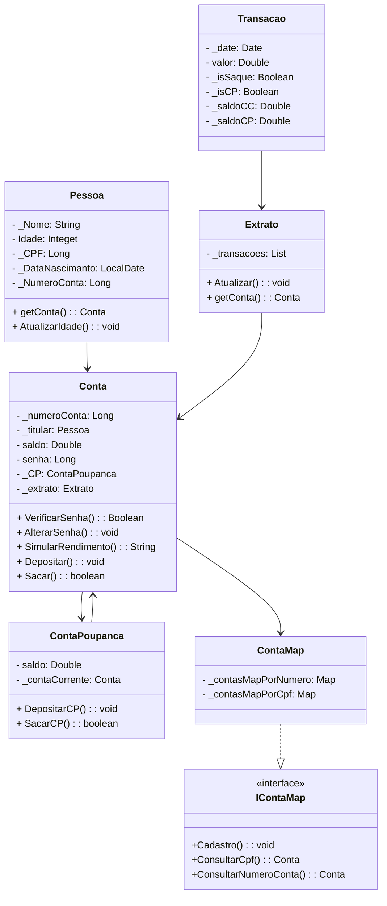

# Projeto Java - Sistema Bancário

## Descrição

Este projeto foi proposto pelo professor [Thyago Sobreira](https://www.linkedin.com/in/thyago-sobreira-82b264150/) como parte do curso de Análise e Desenvolvimento de Sistemas na UEPB, através do projeto "Limite do Visível". O objetivo é desenvolver um modelo de conta bancária para aprimorar habilidades de Programação Orientada a Objetos (POO).

## Avaliação Proposta - Conta Bancária

Um renomado grupo do setor financeiro deseja implementar um sistema para um de seus bancos. Eles confiaram ao nosso grupo essa importante e delicada missão, devido ao nosso conhecimento em Java. O sistema deve possuir as seguintes características e funcionalidades:

- Criação de **Pessoas** (correntistas) com atributos como **Nome, Idade, CPF e Número da Conta**.
- Criação de **Contas**, que incluem o **Titular** (do tipo Pessoa), **número da conta** e **saldo**. Funções de **depósito e saque** devem estar disponíveis.
- Possibilidade de dois tipos de conta:
    - **Conta Corrente**
    - **Conta Poupança**
- Movimentação financeira entre os dois tipos de conta.
- Na **Conta Corrente**, a cada **R$100 depositados**, o cliente deve receber um rendimento de **0,05%**.
- Para realizar um depósito na **Conta Poupança**, o cliente deve ter saldo disponível na **Conta Corrente**.

## Requisitos Técnicos

- Utilização de **Classes**.
- Aplicar **Encapsulamento**.
- Utilizar **Herança**.
- Aplicar **Polimorfismo** (se necessário).
- Criar **Relação entre Classes**.
- Toda a manipulação deve ser realizada no **método `main` do projeto**.

## Diagrama de Classes

---

Este projeto visa consolidar conhecimentos em Java e POO por meio da criação de um sistema bancário funcional e bem estruturado.
